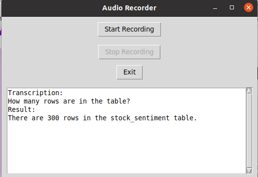
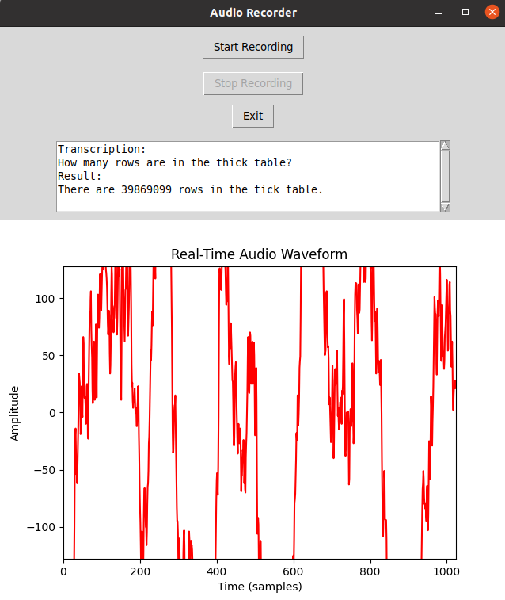

# Introduction

Analyzing stock tick data in SingleStoreDB using LangChain and OpenAI's Whisper. Following this, we aim to build GenAI Text-to-Speech Apps.

# Loading data
- [load_stock_tick_data_from_kafka_into_singlestoredb](notebook/load_stock_tick_data_from_kafka_into_singlestoredb.ipynb)

# Analyzing data
- [quick_tip_analyzing_stock_tick_data_in_singlestoredb_using_langchain](notebook/quick_tip_analyzing_stock_tick_data_in_singlestoredb_using_langchain.ipynb)

# Installing
```
cd openai-whisper/python
bash install.sh
python3 -m venv env
source env/bin/activate
pip install -r requirements.txt
cp constants.example.py constants.py
```

Updating details in the `constants.py` 
# Getting started
```
python3 record-transcribe.py
```


```
python3 record-transcribe-visualise.py
```



```
python3 record-transcribe-visualise-speak.py
```


# References
[Quick tip: Analysing Stock Tick Data in SingleStoreDB using LangChain and OpenAI's Whisper](https://medium.com/@VeryFatBoy/quick-tip-analysing-stock-tick-data-in-singlestoredb-using-langchain-and-openais-whisper-5c5516fc0443)