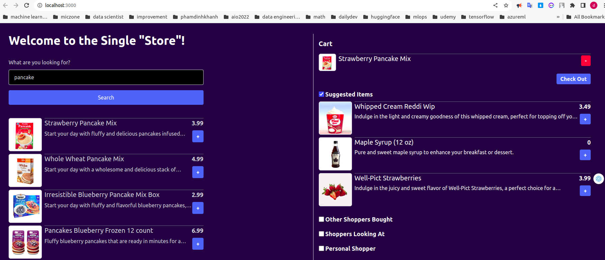

## Introduction
This is a simple application created with create-next-app. It demonstrates various recommendation techniques using SingleStore and ChatGPT.

A recommender system that requires no model building leverages ChatGPT for cost savings and SingleStore for near-real-time data processing.

## Installing node
[Node Version: 20.9.0 (includes npm 10.1.0)](https://nodejs.org/en/download)

## Creating an account on [singlestore](https://www.singlestore.com/)
Create a workspace, connect with Mongosh

We have a `SINGLESTORE_KAI_URI=`

```
mongodb://<user>:<password>@svc-db4f8205-30b8-4f32-b553-79453747d4e0-mongo.aws-singapore-1.svc.singlestore.com:27017/?authMechanism=PLAIN&tls=true&loadBalanced=true
```

## Preparing the database

The data powering this demo was produced using generative AI. Prior to running
the demo, the data must be loaded into an instance of SingleStore through
SingleStore Kai. You must load the full set of products, but you can let
load-orders and load-analytics run as long as you want to get the amount of data
you desire.

```
export SINGLESTORE_KAI_URI="mongodb://..."
npm run load-products --input=data/files/products-embed.json
npm run load-orders --items=data/files/items-dict.json --orders=data/files/orders.json
npm run load-analytics --items=data/files/items-dict.json
```

## Running the app

Create a .env.local file with your OPENAI key and SingleStore Kai URI.

```
OPENAI_API_KEY="sk-..."
SINGLESTORE_KAI_URI="mongodb://..."
```

Run `npm run dev` to start the application on http://localhost:3000

Enter `user="singlestore" && pwd="kaipass"` to login the application

Try it out!



## References
[Singlestore-Kai-Example](https://github.com/singlestore-labs/singlestore-kai-examples/tree/main/recommender)

